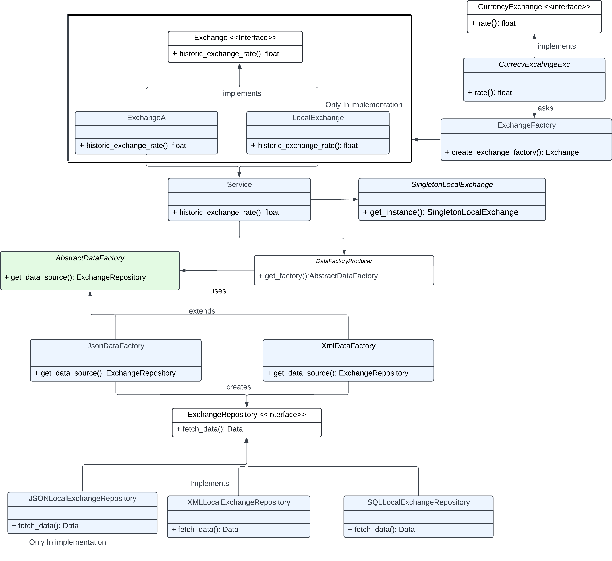

Run the **main.rb** file

## Design Decisions

### UML

### 1. Problem Statement:

* Future Scalability: 
Design the system to accommodate potential changes in the data source i.e (XML, SQL, NOSQL)

* Multiple Exchange Support: Handles the addition of multiple exchanges without redesigning the existing code-base

* Currency Data: Given the potential inconsistency in conversion data, i.e currently in EUR but subject to change in different regions.

### 2. Design's used:
* Singleton Design 
* Factory Design 
* Abstract Factory Design

### 3. Data Source Flexibility With Optimisation:

The data source main function is to provide structured data for a specific exchange from desired source. 

#### Design Pattern

* #####  Abstract Factory Pattern:
     * Used an abstract factory to handle diverse data formats across exchanges, ensuring consistent functionality and preparing for potential transitions to SQL, XML.     
     * Ensures consistency by adhering to a common interface or protocol for created objects.
     * Enables interchangeability between different families of objects, supporting easy switching between SQL and XML implementations.
     * Encapsulates the creation of objects, separating it from the rest of the code.
     * New factories can be introduced without modifying existing client code, allowing for adaptability to evolving data formats.

       
* ##### Singleton Pattern:
     * To avoid frequent query for the past data, implemented a singleton class to store the structured_data upon the first query.
     * The singleton class is initialized only once, capturing Map data and storing the instance for subsequent requests.
     * Further requests access the existing instance, eliminating the need to parse JSON and improving overall performance. 
     * Each Exchange has one singleton class as per the current complexity, the design can be changed at par with complexity for future scale.

 ##### Garbage Collector:
  * Ruby's garbage collector to automatically clear memory after a certain period.
  * The singleton class, if reinitialized after garbage collection, resolves the problem of retaining **outdated** data.
 

#### Data Structure:
* Chose **HashMap** to structure data, optimizing search time complexity to **O(1)** and space complexity to O(size of the data).

Implemented a **HashMap** structure where the date is the key, and the corresponding value is a hash with:

    Map<Date, {conversion_source_currency, Map< curr_symbol , value>}>
*  Key **src**, representing the source currency, mapped to a hash with currency **symbols** as keys and **currency_value** as values.
*  Ensured quick retrieval of currency conversion rates for a specific date with constant time complexity.
*  Achieved a space-efficient representation, scaling with the size of the data.

### 4. Exchange
The main function of this design is to serve migration and adding multiple Exchanges to the code-base

##### Factory Design:
* Enables easy addition of new exchange types by extending the factory without modifying existing client code and scalability.
* Encapsulate the creation of exchange-related objects to achieve modularity
* All exchange instances follow to a common interface

### 5. Improvements
* As the task was to raise an Exception for fail cases, but it could be handled in more centralised way with responses than **ERROR THROW**.

